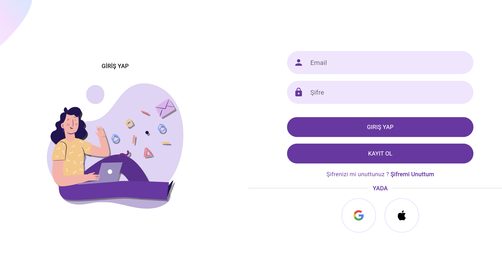
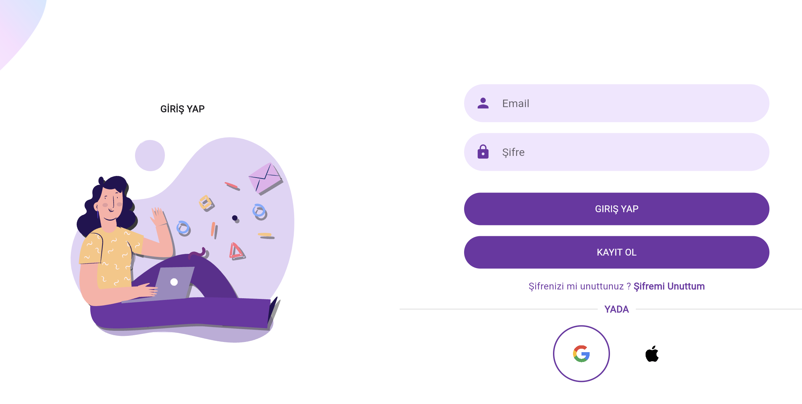
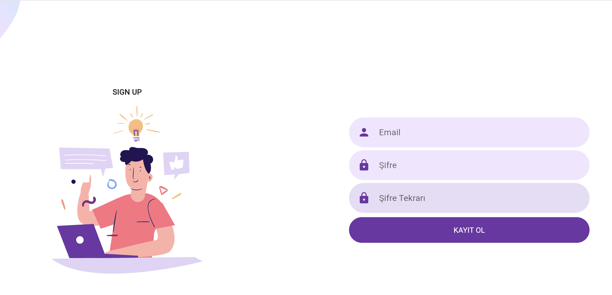
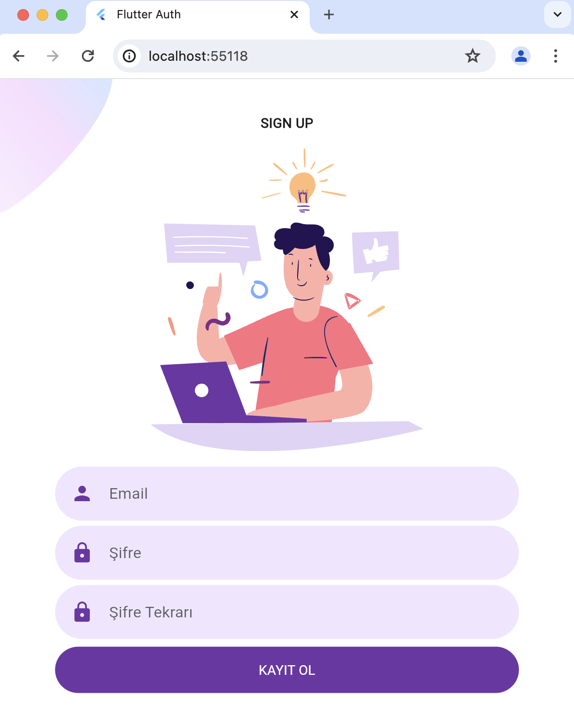

# Flutter Firebase Responsive Login UI

A Flutter project showcasing a responsive login UI integrated with Firebase for authentication. This project aims to provide a clean, modern, and responsive login interface that works seamlessly across different screen sizes and devices.

## Features

- Responsive UI for mobile and web
- Firebase Authentication
- Clean and modern design

## Demo

Check out the demo video on YouTube:

## Screenshots

Here are some screenshots of the app:

## Getting Started

To get started with this project, follow these steps:

### Prerequisites

- Flutter SDK: [Install Flutter](https://flutter.dev/docs/get-started/install)
- Firebase account: [Create a Firebase account](https://firebase.google.com/)

### Setup

1. Clone the repository:
2. Setup Firebase
3. Pub Get

